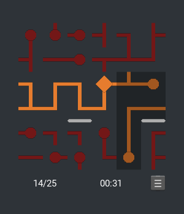

# netwalk
A clone of the famous netwalk game using Python3 & Kivy



## Installation

### Linux

* Clone this repository or download it as a ZIP file.
* Install Python >= 3.3 from your distro's package manager.
* Install Kivy from the package manager -- the package is often called python-kivy or python3-kivy -- or follow these  [detailed instructions](https://kivy.org/docs/installation/installation-linux.html).
* If you are going to do development, consider using [virtualenvwrapper](https://virtualenvwrapper.readthedocs.io/).
* Start the game: `python3 net.py`

### Windows

* Clone this repository or download it as a ZIP file.
* Download the latest Python3 version from [here](https://www.python.org/downloads/) .
* When installing, make sure to check "Add Python to PATH".
* Open a command line (cmd.exe) and type in the following commands (more [detailed instructions](https://kivy.org/docs/installation/installation-windows.html)):
```
python -m pip install --upgrade pip wheel setuptools
python -m pip install docutils pygments pypiwin32 kivy.deps.sdl2     kivy.deps.glew
python -m pip install kivy
```
* `cd` into the netwalk directory and start the game: `python net.py`
